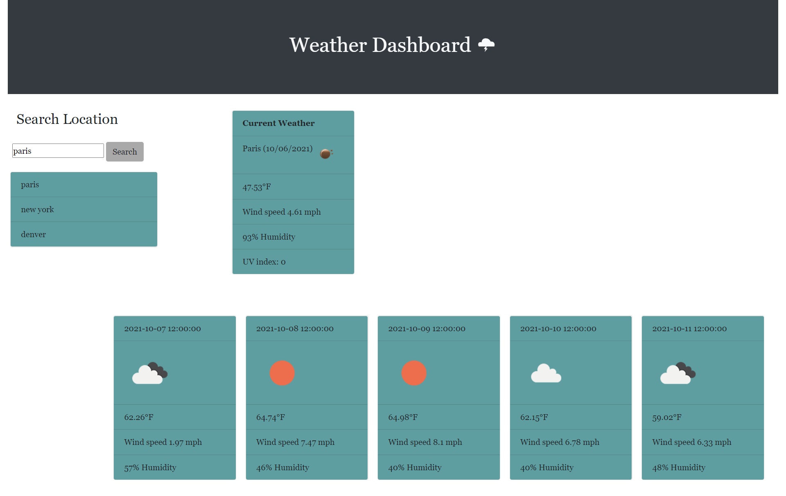

# Weather-Dashboard

Weather Dashboard

# created by:

Jackson Barker

# Weather Dashboard

This weather dashboard is tool for the user to search for current and forecasted weather conditions in cities around the world. The weather conditions are pulled from open weather API's provided by openweathermap.org.

# Usage

- When the page loads the user will enter the name of a city they would like to see the weather for.
- A card will load and display the current weather for the input location. It will display the location, date and an icon representing the current weather. It will also display the current temperature, wind speed, humidity and UV index.
- At the bottom of the page five cards representing the five day forecast will also load, these cards will contain the date, forecasted weather icon, forecasted temperature, forecasted wind speeds and the forecasted humidity.
- The search history of the user will be store in local storage and displayed for the user to see under the search box. 

# Link

https://jackson-barker.github.io/Weather-Dashboard/

# Screen Shot 

